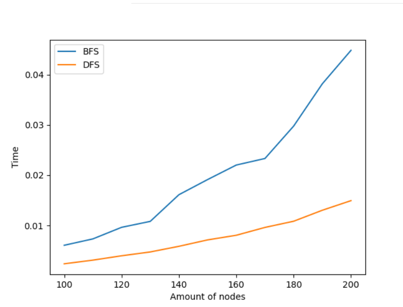
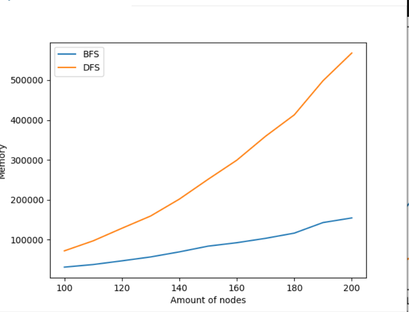
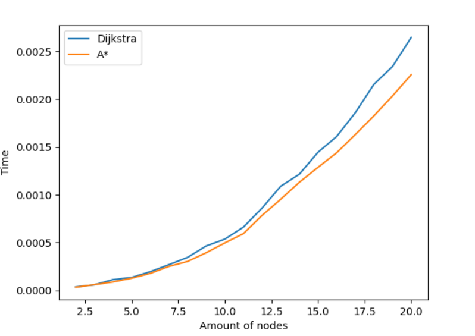
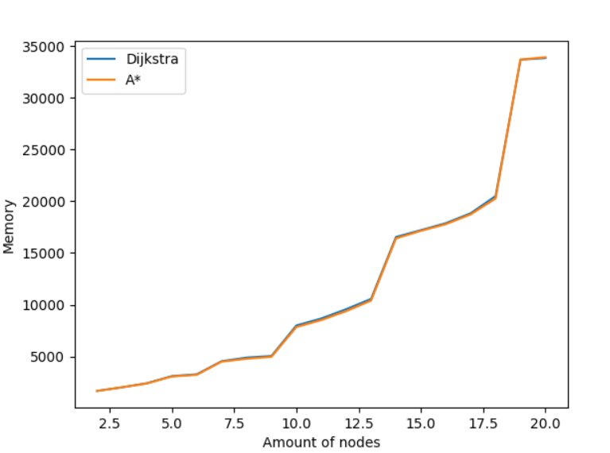
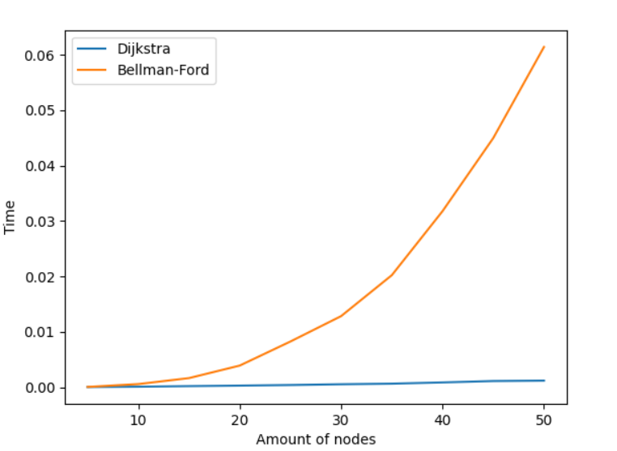
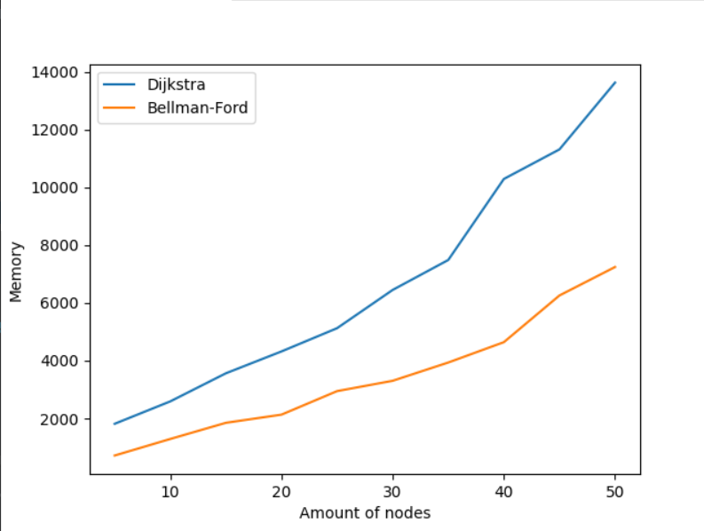
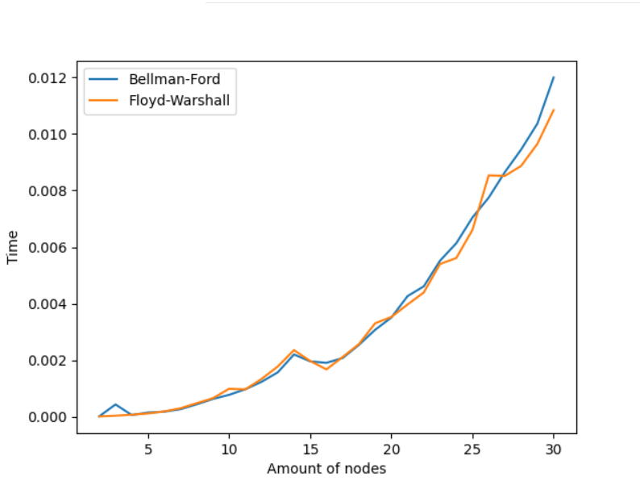
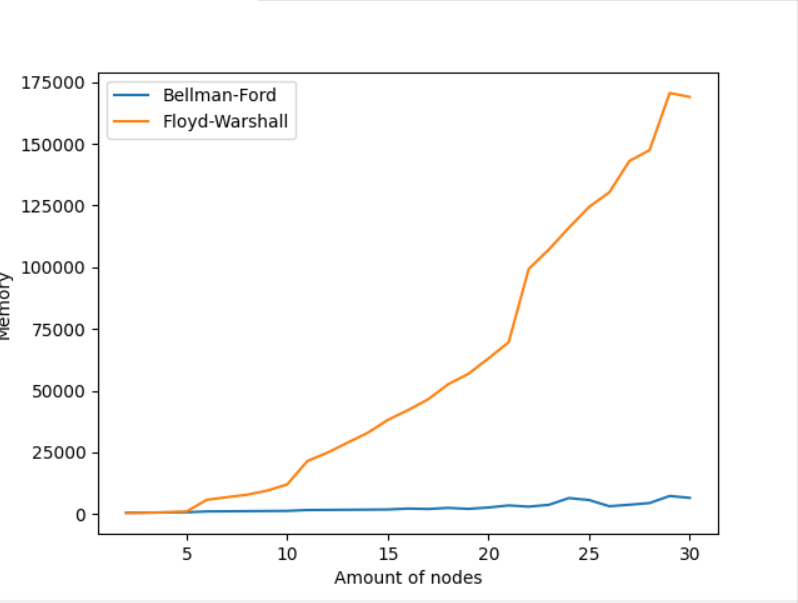

# Отчет о алгоритмах поиска в графе

# Ориентированные графы. DFS vs BFS.

Генерируем рандомный ориентированный граф.

Находим путь ко всем вершинам. 

Считаем среднюю память и время

Количество вершин: от 100 до 200 с шагом 

Ожидаемое количество ребер из каждой вершины: Количество вершин * 0,1

Результаты:

### Вывод: поиск в глубину работает быстрее однако требует больше памяти. Нужно учитывать это при решении задач поиска в ориентированном графе.

## Dijkstra vs A*. Взвешенная матрица. Каждая вершина соединена с соседями

Количество вершин: от 2^2 до 20^2 (2^2, 3^2, 4^2, …, 20^2) 

Количество ребер из каждой вершины: 4 в соседей по горизонтали и вертикали.

$Эвристика = \sqrt{(n.x - goal.x)^2 + (n.y - goal.y)^2}$

Возможные значения ребер: 1 до 10

Находим расстояния до всех вершин.

### Вывод: эвристика помогает немного уменьшить время работы алгоритма без увеличения памяти. Главное выбрать правильную эвристическую функцию.

## Dijkstra vs Bellman-Ford. Два разных подхода.

Количество вершин: 5 до 50 с шагом 5

Вес ребра: от 0 до 100

Ищем расстояния до всех вершин

### Вывод: по времени Дейкстра значительно выйгрывает (Это очевидно потому что сложность Дейкстры $O(n logn + E)$ , а сложность Беллмана Форда $O(n*E)$ ). Однако памяти тратится больше и памяти тратится нестабильно много.

## Floyd-Warshell vs Bellman-Ford. Отрицательные веса в графе.

Количество вершин: 2 до 31

Возможные веса: -1 до 100

Расстояния до всех вершин. Без индексирования.

### Вывод: если количество ребер совпадает с количестовом вершин то работа этих двух алгоритмов совпадает. Если сделать графы разреженными то Беллман Форд в теории должен показать более лучший результат.